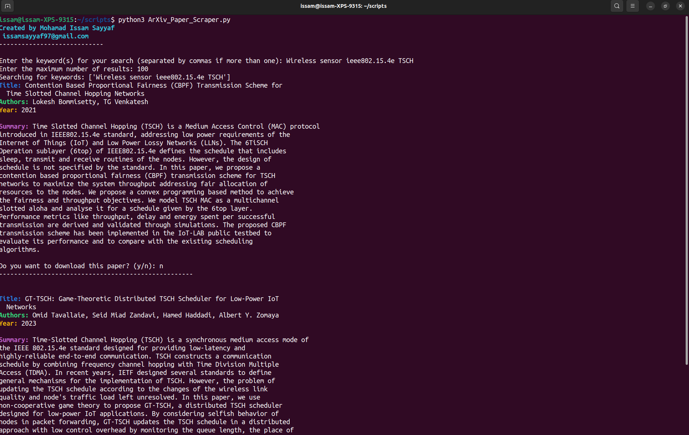

# ArXiv-Paper-Scraper
This Python script allows you to search for academic papers on ArXiv based on a given keyword and a maximum number of results.

## Requirements

- **Python 3.x**
- **Required Python packages**: `feedparser`, `requests`

You can install these using pip:

```bash
pip install feedparser requests
```

## Usage

To use the script, simply run it using Python:

```bash
python ArXiv_Paper_Scraper.py
```
You'll be prompted to enter the keyword(s) for your search and the maximum number of results. The script will then fetch the papers from ArXiv and save them in a text file named new_papers.txt. It will also display the title, authors, and summary in the console. If the file new_papers.txt does not exist, the script will automatically create it.



## License

This project is licensed under the MIT License - see the [LICENSE](LICENSE) file for details.
